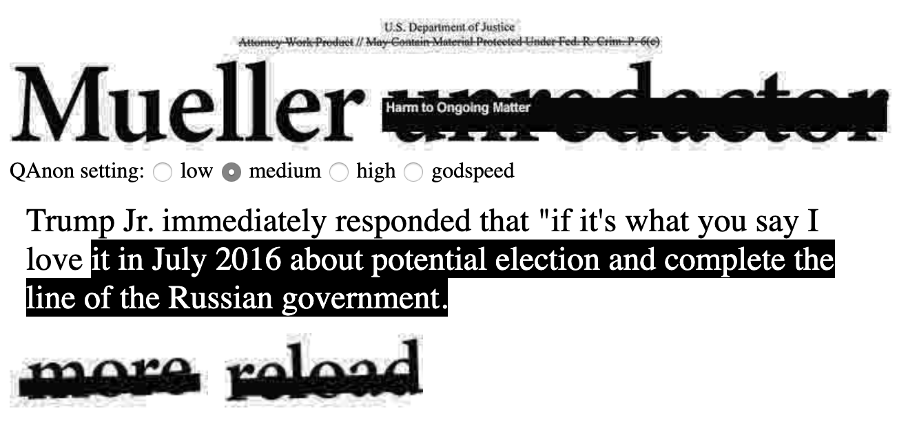

# Mueller unredacter

A speed project generating text completions with an LSTM trained on the Mueller report. I used [data prepared by Factbase](https://docs.google.com/document/d/1d8G6MlxNX5JDoo2ZR3cH3OYiROWVOFBEZZiCF4p6CEM/edit) with a little extra preprocessing to remove headings and footnotes. It's nowhere near perfect but you can find it at `mueller-report.txt`. Then I trained a network using [this port of char-rnn by Sherjil Ozair](https://github.com/sherjilozair/char-rnn-tensorflow) and loaded it with [ml5.js](https://ml5js.org/docs/CharRNN).

It doesn't work on mobile right now, due to some bugs with either ml5.js or TensorFlow.js.